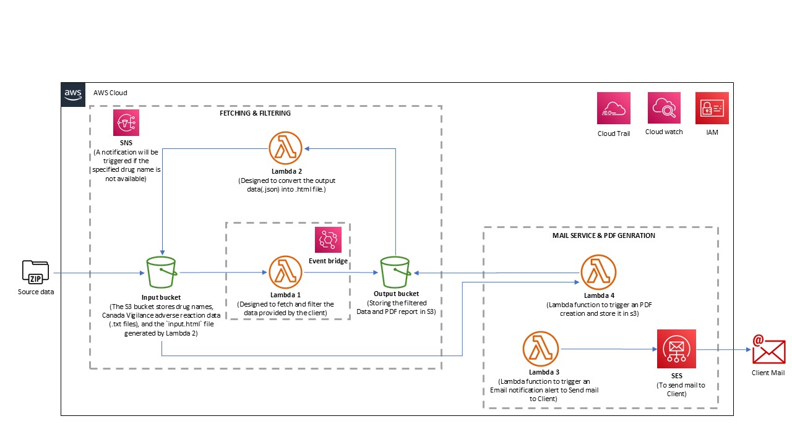

# Canada_Vigilance_Project_API

## Problem Statement
- Manually searching the Canada Vigilance Database for numerous drug products is time-consuming and prone to errors, hindering efficient decision-making.
- The current process lacks an automated solution to screen drug products, resulting in delays in retrieving critical data necessary for timely decisions.
- Ensuring the accuracy and timeliness of retrieved data is challenging without automation, increasing the risk of missing important updates.
- The manual approach does not scale well with the growing volume of drug products needing monitoring, leading to operational inefficiencies.
- The client requires an automated solution to periodically screen the Canada Vigilance Database for specific products on the Health Canada website, streamlining the monitoring process and enhancing overall efficiency.

## Solution Architecture
The solution architecture is designed to interact with the Canada Vigilance API to extract data on drug products and related adverse reactions. The data is retrieved using unique identifiers like drug IDs and report IDs, processed directly from the data source, and then made accessible for further analysis or reporting.

## Proposed Solution
- Develop an automated system to retrieve adverse reaction reports from the Canada Vigilance Database based on drug names provided by the client.
- Fetch drug names listed in a Text file (.txt) provided by the client (stored in a standard storage system like S3) to fetch the Adverse Drug Reaction report.
- Automatically collect and organize relevant adverse reaction reports associated with the specified drugs to ensure timely client notifications via email.
- Send email notifications periodically to the client with the adverse reaction reports for the drugs being monitored.
- Create a PDF file consisting of detailed report of the data fetched from the automated system (Each row of the adverse reaction report generates one page of PDF report).
- Store this periodically generated PDF file in a standard storage system like S3. Ensuring that only new data is stored in PDF formats and sent in the notifications to prevent duplication, enhancing responsiveness and decision-making.

